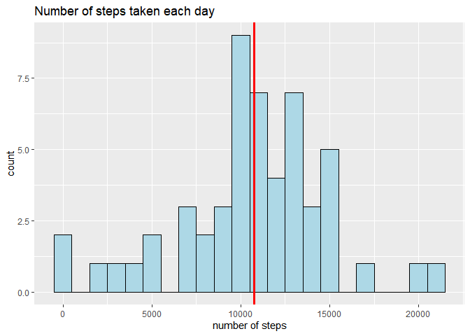
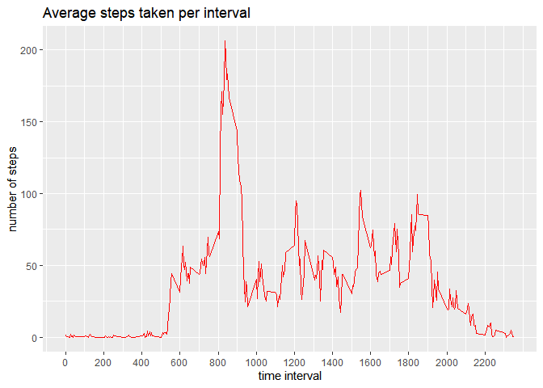
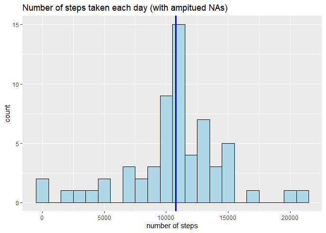
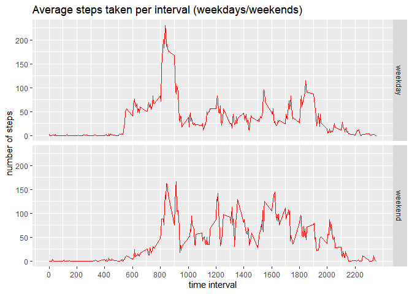

## Introduction
This is a simple and short example of an exploratory data analysis:
A case study that relies on tracking and counting an individual's movements (steps) through a smartwach device ( [Fitbit](http://www.fitbit.com/) ) .  
The [data](https://d396qusza40orc.cloudfront.net/repdata%2Fdata%2Factivity.zip) is then collected and explored in an attempt to answer some questions.

## Loading and preprocessing the data
The data is loaded and the date variable is transformed from "character" to the proper "Date" type

```r
df<-read.csv("activity.csv")
df$date<-as.Date(df$date , format = "%Y-%m-%d")
```


## What is mean total number of steps taken per day?
a new data frame "df2" is created to contain the mean number of steps taken per day

```r
x<-tapply(df$steps,df$date,sum)
df2<-data.frame(date=names(x), steps=as.vector(x))
```

Now we're able to make a histogram of the total number of steps taken each day.
we plot the histogram with a bindwidth equal to a 1000 step.

```r
library(ggplot2) 
g<-ggplot(df2,aes(x=steps)) + 
   geom_histogram(binwidth=1000,fill="lightblue" , color="black") +
   geom_vline(data=df2,aes(xintercept = mean(steps , na.rm=TRUE)), color = "blue" , size= 1.2  ) +
   geom_vline(data=df2,aes(xintercept = median(steps , na.rm=TRUE) ) , color="red" , size=1.2 ) +
   labs(title = "Number of steps taken each day" , x="number of steps")
print(g)
```

```
## Warning: Removed 8 rows containing non-finite values (stat_bin).
```

<!-- -->

```r
ggsave("figures\\plot1.png") 
```

```
## Saving 7 x 5 in image
```

```
## Warning: Removed 8 rows containing non-finite values (stat_bin).
```
The mean and the median of the total number of steps taken per day :

```r
sprintf("Mean = %f",mean(df2$steps , na.rm=TRUE))
```

```
## [1] "Mean = 10766.188679"
```

```r
sprintf("Median = %f",median(df2$steps , na.rm=TRUE))
```

```
## [1] "Median = 10765.000000"
```
**NOTE** : in the graph above , the mean and the median are so close that their representive lines overlapped. 

## What is the average daily activity pattern?  
We calculate the average number of steps per interval across all days and store the resulting data in a "df3".

```r
x<-tapply(df$steps , df$interval , mean , na.rm=TRUE)
df3<-data.frame(interval= as.numeric(names(x)), steps= as.vector(x) )
```

now we represent the data in a time series plot:

```r
g<-ggplot(data=df3 , aes(x=interval , y=steps)) + 
   geom_line(color="red")+
   scale_x_continuous(breaks=seq(0,2355,200) )+
  labs(title="Average steps taken per interval", x="time interval", y="number of steps")

print(g)
```

<!-- -->

```r
ggsave("figures\\plot2.png")
```

```
## Saving 7 x 5 in image
```

The time interval of the day with most average steps taken is:

```r
df3[ which.max(df3$steps), 1]
```

```
## [1] 835
```
**NOTE** : the interval 835 translates into 8:35 AM.


## Imputing missing values  

We noticed that some data on the number of steps are missing. We want to have a sense of the impact of these NAs on the study.   
number of NAs :

```r
print (nrow(df[is.na(df$steps)  , ]))
```

```
## [1] 2304
```
number of NAs as a *percentage* of the whole data:

```r
print(nrow(df[is.na(df$steps)  , ])/ nrow(df) *100)
```

```
## [1] 13.11475
```

To fill all the gaps caused by the *NA* values in the dataset, I replaced each of the missing number of steps in a certain time interval in a certain day with the mean of the number of steps of that save time interval actoss the rest of days.

```r
df4<-df
for(i in 1:nrow(df4))
{
  if(is.na(df4[i,1]) )
    df4[i,1]<-df3[df3$interval==df4[i,3] , 2]
}
```

Now, with our newly filled dataset,  we calculate the mean of the number of steps taken per day again and store it in df5.

```r
x<-tapply(df4$steps , df4$date , sum)
df5<-data.frame(date=names(x), steps=as.vector(x))
```
and we plot the resulting data in the form of a historam.

```r
g<-ggplot(df5, aes(steps)) +
   geom_histogram(binwidth=1000,color="black" , fill="lightblue")+
   geom_vline( data=df5 , aes(xintercept = mean(steps) ) , color="red", size=1.2)+
   geom_vline( data=df5 , aes(xintercept = median(steps)), color="blue", size=1.2)+
   labs(title = "Number of steps taken each day (with ampitued NAs)" , x="number of steps")
   
   print(g)
```

<!-- -->

```r
   ggsave("figures\\plot3.png")
```

```
## Saving 7 x 5 in image
```

The mean and the median of the number of steps taken each day with ampitued data:

```r
sprintf("Mean = %f",mean(df5$steps))
```

```
## [1] "Mean = 10766.188679"
```

```r
sprintf("Median = %f",median(df5$steps ))
```

```
## [1] "Median = 10766.188679"
```

**because of filling the missing data with the means of the full data , the mean and the median got centerd around the same value  1.0766189\times 10^{4} **


## Are there differences in activity patterns between weekdays and weekends?  

we add the week factor to the given data using the *weekdays()* function.

```r
df<-df4
   x<-(weekdays(df$date) %in% c("samedi","dimanche"))
   df$type[x==TRUE]<-"weekend"
   df$type[x==FALSE]<-"weekday"
   df$type<-as.factor(df$type)
```

now we create a new data frame containing the the number of steps taken each interval with the new factor variable "type" that tells us whether it's a weekday or a weekend.

```r
   x<-tapply(df$steps ,list(df$type,df$interval), mean)
   df6<-data.frame(steps=numeric(), interval=numeric(), type=factor(levels = c("weekday","weekend")))
   for(i in 1:ncol(x)) 
     for(j in 1:nrow(x))
     {
       df6[nrow(df6)+1 , ]<- list(steps=x[j,i] , 
                                interval=as.numeric(colnames(x)[i]) ,
                                type=rownames(x)[j]
                                )
     }
```
now we make our time series plot of the average number of steps per intervale in either a weekday **or** weekend

```r
   g<-ggplot(df6,aes(interval,steps)) + 
      geom_line(color="red" )+
      facet_grid(type~.) +
     scale_x_continuous(breaks=seq(0,2355,200) )+
     labs(title="Average steps taken per interval (weekdays/weekends)", x="time interval", y="number of steps")
    print(g)
```

<!-- -->

```r
  ggsave("figures\\plot4.png")
```

```
## Saving 7 x 5 in image
```

**We can notice a slight decrease in the number of average steps taken in the morning hours of weekends compared to weekdays, which might be due to waking up late in some weekends.  
we also notice a small increase in the number of steps taken in some hours of the afternoon during the weekends.**
